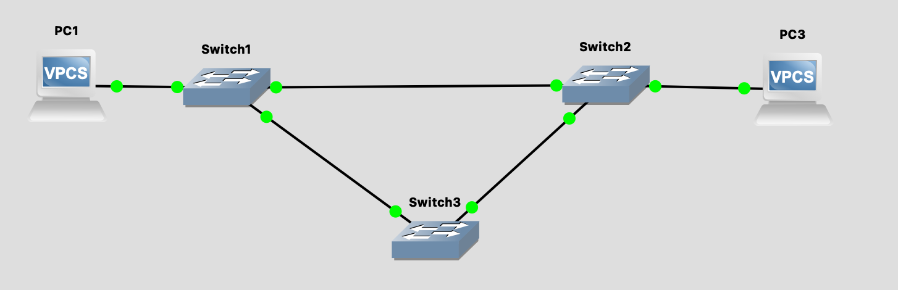

### Layer 2

- Switch is a Layer 2 Ethernet device with no console and no operating system.

- Layer 2 networks can be categorized by assigning VLAN IDs to each interface.

- 2 switches with different VLAN IDs cannot connect with each other.

- VLAN ID maximum value is 4096 bits. Since switch loops can occur inside a VLAN ID network, overlay networks are used.

### GNS3 Layer2 Network


On PC1:

```bash
ip 192.168.1.1/24
show ip
```

On PC2:

```bash
ip 192.168.1.2/24
show ip
```

Add both the PCs to the same subnet and run the ping command.

To define the VLAN ID of a router interface:

```bash
interface FastEthernet0/2
switchport access vlan 10
```

### Switch Loops

Since switches use unicast flooding with no maximum hop number, it's possible for a packet to be lost due to a loop in the graph. This is a layer 2 limitation.



In this setup, with an aditional router, most of the ping packets timeout

```bash
PC1> ping 192.168.1.3 -c 50

192.168.1.3 icmp_seq=1 timeout
192.168.1.3 icmp_seq=2 timeout
192.168.1.3 icmp_seq=3 timeout
192.168.1.3 icmp_seq=4 timeout
192.168.1.3 icmp_seq=5 timeout
192.168.1.3 icmp_seq=6 timeout
```

### ARP

- Layer 2 networks work using MAC address and not IP-addres
- ARP is a broadcasting protocol which uses `Unicast Flooding` i.e; the packet is sent to all the devices connected to the switch for finding the MAC address of a machine with a  given IP address.
- The switch caches these port -> mac address mapping for further usage.

- To find the MAC address of a given IP address
```bash
arping -I <interface> <IP-address>
```

- To check the local ARP cache table
```bash
ip neigh
```

### VRRP (Virtual Router Redundancy Protocol)

Implement using `keepalived`

https://keepalived.readthedocs.io/en/latest/case_study_mixing.html

```
# VRRP Instance Configuration — VI_1
#
# How this works:
#   This node participates in a VRRP group that owns a shared floating VIP (192.168.31.160).
#   The MASTER holds the VIP; if it dies, the highest-priority BACKUP takes over.
#
# Two separate signalling mechanisms keep this working:
#
#   1. Heartbeats (advert_int)
#      The MASTER periodically multicasts advertisements to 224.0.0.18 (IANA-reserved for VRRP,
#      RFC 3768/5798) on protocol 112. Only nodes that have joined this multicast group receive
#      them — normal hosts silently discard them. 224.0.0.18 is link-local (TTL=1), so
#      advertisements never leave the subnet. If a BACKUP misses 3 consecutive advertisements,
#      it declares the MASTER dead and promotes itself.
#
#   2. Gratuitous ARP (GARP)
#      When a node becomes MASTER it broadcasts "IP 192.168.31.160 is at MAC <mine>" to the
#      entire L2 segment, forcing switches and hosts to flush stale ARP cache entries immediately.
#      Without this, traffic would keep flowing to the old MASTER's MAC until ARP caches
#      naturally expired (potentially minutes of downtime). GARPs are re-sent periodically
#      as a safety net for devices with long ARP TTLs.
#
#   Heartbeats  → talk to VRRP peers only  (who owns the VIP?)
#   GARPs       → talk to the whole network (where is the VIP now?)

vrrp_instance VI_1 {
    state MASTER                         # Initial state of this node (MASTER or BACKUP)
    interface wlo1                       # Network interface to run VRRP on
    virtual_router_id 51                 # Cluster ID — must match across all nodes in the same VRRP group (Works in L3)
    priority 150                         # Election priority; highest value wins MASTER role (range: 1–254)
    advert_int 1                         # Interval (seconds) between VRRP advertisement multicasts (heartbeat)

    nopreempt                            # Prevents a recovered former MASTER from reclaiming the role automatically

    authentication {                     # Shared secret to authenticate VRRP peers and prevent rogue nodes
        auth_type PASS                   # Authentication method: PASS (simple plaintext password)
        auth_pass k@l!ve1               # Shared password — must be identical on all nodes in this VRRP group
    }

    virtual_ipaddress {
        192.168.31.160/32               # Floating VIP assigned to whichever node is currently MASTER
    }

    garp_master_delay 1                  # Seconds to wait after election before sending the first GARP (allows NIC stabilisation)
    garp_master_repeat 5                 # Number of GARPs to send in a burst upon becoming MASTER (helps flush stale ARP caches)
    garp_master_refresh 60               # Interval (seconds) at which GARP bursts are re-sent while remaining MASTER
    garp_master_refresh_repeat 2         # Number of GARPs to send per periodic refresh event
}
```


Sending GARP request:

```
 sudo arping -U -I enp2s0 192.168.1.181
```
