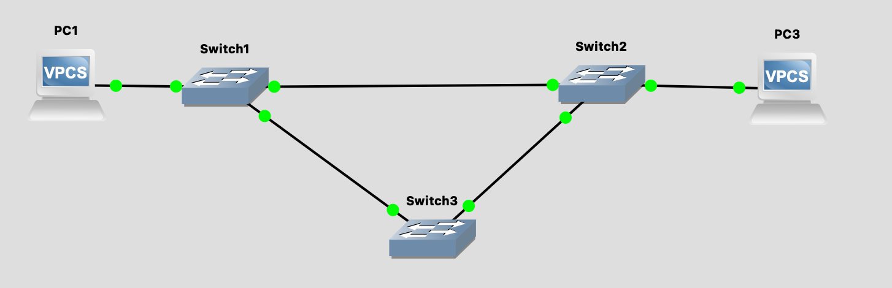

## Intra VLAN Routing

- Device: L2 Switch
- Identifiers of a L2 packet: MAC address, VLANID
- Switch interfaces do not have a MAC address.
- A switch caches the port -> MAC address of device connected to it whenever an ARP request/ response is sent
- Broadcast MAC address is same irrespective of the VLAN IDs.

#### Routing

- If PC1 at Gi0/1 wants to connect to PC2 at Gi0/2, an ARP request is sent by PC1 which asks: "What is the MAC address of IP <PC2-IP>. Tell <PC1-IP>". Basically, ARP request and response packets are L3 packets
- Since this is an ARP request, the source MAC is the PC1 MAC Address and destination is the Broadcast MAC address
- The switch caches the Gi0/1: PC1 MAC address mapping
- The request is flooded on all the interfaces belonging to VLAN ID (reduced flooding due to interface isolation)
- PC2 sees that the IP belongs to one of its interfaces
- It responds by sending an Ethernet packet with source as its IP address and destination as the PC1 MAC address

#### Configuration

- Assign VLAN ID to an interface:

```
# Privilege escalation
enable

# Enter configuration mode
configure terminal

# Create a new VLAN ID 99 and assign a name to it
vlan 99
name INTER_VLAN_TEST
end

# Check the VLANIDs configured on the switch
show vlan brief

# Enter configuration mode
configure terminal

# Configure the interface, Use access mode on the interface and Assign a VLANID to the interface
interface Gi0/1
switchport mode access
switchport access vlan 99
end

# Check that the interfaces have been added to the VLANID
show interfaces status
```

- show vlan brief command output

```bash
sw-1# show vlan brief
VLAN Name                             Status    Ports
---- -------------------------------- --------- -------------------------------
1    default                          active    
10   DEFAULT                          active    
99   INTER_VLAN_TEST                  active    Gi0/1, Gi0/2
```

- show interfaces status command output

```bash
sw-1# show interfaces status
Port      Name               Status       Vlan       Duplex  Speed Type
Gi0/1                        connected    99         a-full  1000  10/100/1000BaseTX
Gi0/2                        connected    99         a-full  1000  10/100/1000BaseTX
```

- Check the switch MAC address table

```
# Flush the table
clear mac address-table dynamic

# Check the cache
sw-1# show mac address-table
          Mac Address Table
-------------------------------------------
 
Vlan    Mac Address       Type        Ports
----    -----------       --------    -----
  99    001a.2b25.5ed8    DYNAMIC     Gi0/1
  99    001a.2b08.5435    DYNAMIC     Gi0/2
```

- Check the devices connected to the switch interfaces

```
show cdp neighbors
```

## Intra VLAN routing across switches

#### Types of switch interfaces:

- Access mode:
          - A switch interface is of type access by default.
          - This is the normal forwarding mode

- Trunk mode:
          - Supports dot1q encapsulation. All packets are flooded to the trunk port as well. When a packet is leaving a switch, the trunk interface adds a VLAN header to the ethernet packet. The trunk interface on the other switch checks the VLAN packet and floods to all the ports belonging to the VLAN ID

#### Configuration

```
# Create a trunk port
interface Gi0/2
switchport mode trunk
end
```

## Inter VLAN routing (Switch Virtual Interface) on same switch

- Each VLAN has its own SVI
- SVI is a layer 3 interface(available on L3 switches) with a MAC an IP address
- Each port/ virtual interface has a MAC address. But this becomes useful only if is needs to receive packets. Example, if a PC's gateway address is an SVI MAC address. the SVI MAC address becomes relevant

#### Routing

- Create VLAN10 and VLAN20
- Create interfaces for these VLANs and assign IP address to them
- Routing table is created automatically (to move packets between SVIs)
- Attach PC1 to a switch interface, assign VLAN1 to that interface. Assign PC1 gateway address as the VLAN10 SVI IP address and an IP address within the mask range
- Attach PC2 to a switch interface, assign VLAN2 to that interface. Assign PC2 gateway address as the VLAN20 SVI IP address and an IP address within the mask range


#### Configuration

```
enable
configure terminal

vlan 10
 name SUBNET1

interface vlan 10
 ip address 10.0.10.1 255.255.255.0
 no shutdown

end
```

## Inter VLAN routing (Router on a stick) across switch

## Spanning tree (Per VLAN)

- How to check the MAC address and priority of the switch
- How to check which switch is the root
- How to check designated and blocked port status
- How does the switch calculate the minimum distance to the root
- Are all the othe ports which can reach the root marked designated/blocked
- How is a blocked port unblocked

### Layer 2

- Switch is a Layer 2 Ethernet device with no console and no operating system.

- Layer 2 networks can be categorized by assigning VLAN IDs to each interface.

- 2 switches with different VLAN IDs cannot connect with each other.

- VLAN ID maximum value is 4096 bits. Since switch loops can occur inside a VLAN ID network, overlay networks are used.

### GNS3 Layer2 Network



On PC1:

```bash
ip 192.168.1.1/24
show ip
```

On PC2:

```bash
ip 192.168.1.2/24
show ip
```

Add both the PCs to the same subnet and run the ping command.

To define the VLAN ID of a router interface:

```bash
interface FastEthernet0/2
switchport access vlan 10
```

### Switch Loops

Since switches use unicast flooding with no maximum hop number, it's possible for a packet to be lost due to a loop in the graph. This is a layer 2 limitation.


In this setup, with an aditional router, most of the ping packets timeout

```bash
PC1> ping 192.168.1.3 -c 50

192.168.1.3 icmp_seq=1 timeout
192.168.1.3 icmp_seq=2 timeout
192.168.1.3 icmp_seq=3 timeout
192.168.1.3 icmp_seq=4 timeout
192.168.1.3 icmp_seq=5 timeout
192.168.1.3 icmp_seq=6 timeout
```

### ARP

- Layer 2 networks work using MAC address and not IP-addres
- ARP is a broadcasting protocol which uses `Unicast Flooding` i.e; the packet is sent to all the devices connected to the switch for finding the MAC address of a machine with a  given IP address.
- The switch caches these port -> mac address mapping for further usage.

- To find the MAC address of a given IP address
```bash
arping -I <interface> <IP-address>
```

- To check the local ARP cache table
```bash
ip neigh
```

### VRRP (Virtual Router Redundancy Protocol)

Implement using `keepalived`

https://keepalived.readthedocs.io/en/latest/case_study_mixing.html

```
# VRRP Instance Configuration — VI_1
#
# How this works:
#   This node participates in a VRRP group that owns a shared floating VIP (192.168.31.160).
#   The MASTER holds the VIP; if it dies, the highest-priority BACKUP takes over.
#
# Two separate signalling mechanisms keep this working:
#
#   1. Heartbeats (advert_int)
#      The MASTER periodically multicasts advertisements to 224.0.0.18 (IANA-reserved for VRRP,
#      RFC 3768/5798) on protocol 112. Only nodes that have joined this multicast group receive
#      them — normal hosts silently discard them. 224.0.0.18 is link-local (TTL=1), so
#      advertisements never leave the subnet. If a BACKUP misses 3 consecutive advertisements,
#      it declares the MASTER dead and promotes itself.
#
#   2. Gratuitous ARP (GARP)
#      When a node becomes MASTER it broadcasts "IP 192.168.31.160 is at MAC <mine>" to the
#      entire L2 segment, forcing switches and hosts to flush stale ARP cache entries immediately.
#      Without this, traffic would keep flowing to the old MASTER's MAC until ARP caches
#      naturally expired (potentially minutes of downtime). GARPs are re-sent periodically
#      as a safety net for devices with long ARP TTLs.
#
#   Heartbeats  → talk to VRRP peers only  (who owns the VIP?)
#   GARPs       → talk to the whole network (where is the VIP now?)

vrrp_instance VI_1 {
    state MASTER                         # Initial state of this node (MASTER or BACKUP)
    interface wlo1                       # Network interface to run VRRP on
    virtual_router_id 51                 # Cluster ID — must match across all nodes in the same VRRP group (Works in L3)
    priority 150                         # Election priority; highest value wins MASTER role (range: 1–254)
    advert_int 1                         # Interval (seconds) between VRRP advertisement multicasts (heartbeat)

    nopreempt                            # Prevents a recovered former MASTER from reclaiming the role automatically

    authentication {                     # Shared secret to authenticate VRRP peers and prevent rogue nodes
        auth_type PASS                   # Authentication method: PASS (simple plaintext password)
        auth_pass k@l!ve1               # Shared password — must be identical on all nodes in this VRRP group
    }

    virtual_ipaddress {
        192.168.31.160/32               # Floating VIP assigned to whichever node is currently MASTER
    }

    garp_master_delay 1                  # Seconds to wait after election before sending the first GARP (allows NIC stabilisation)
    garp_master_repeat 5                 # Number of GARPs to send in a burst upon becoming MASTER (helps flush stale ARP caches)
    garp_master_refresh 60               # Interval (seconds) at which GARP bursts are re-sent while remaining MASTER
    garp_master_refresh_repeat 2         # Number of GARPs to send per periodic refresh event
}
```


Sending GARP request:

```
 sudo arping -U -I enp2s0 192.168.1.181
```
