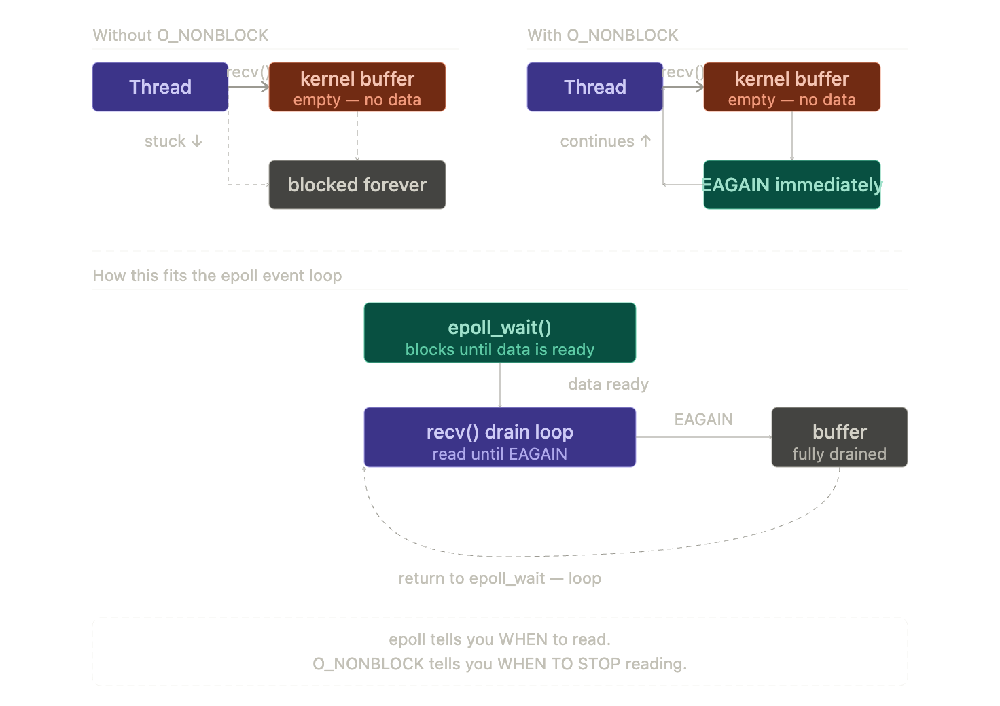

### TCP

In TCP, each connection is identified by the tuple:

```
(source IP, source port, destination IP, destination port)
```

Socket ~= fd

In TCP, both client and server send acknowledgements

#### System Calls

1. `socket`: Creates a socket and returns a socket file descriptor
2. `bind`: Attach the socket file descriptor to a port and IP
3. `listen`: Mark the socket as a listener socket. Internally, the kernel maintains a queue of the client connections, no more than the BACK_LOG.
4. `accept`: Fetch client connection data from kernel queue and move it to a connection file descriptor. One accept call per TCP client. It's a blocking call.
5. `recv`: Get the data from the connection file descriptor and copy it to the program buffer
6. `close`: Close a connection

`accept()` returns a new socket (file descriptor)
Example:

Server is listening on:
```
0.0.0.0:80
```

3 clients connect

```
Client A: 10.0.0.1:50000 → Server:80
Client B: 10.0.0.2:50001 → Server:80
Client C: 10.0.0.3:50002 → Server:80
```

The following sockets are created:

```bash

Socket 1: (Server:80, ClientA:50000)  
Socket 2: (Server:80, ClientB:50001)  
Socket 3: (Server:80, ClientC:50002)
```

#### Single threaded Single TCP connection

Single threaded server which accepts only one client request:

```c
#include  <stdio.h>
#include  <stdlib.h>
#include  <string.h>
#include  <unistd.h>
#include  <arpa/inet.h>
#include  <sys/socket.h>

#define  PORT  8080
#define  BACKLOG  5 // max pending connections in kernel accept queue
#define  BUFFER_SIZE  1024 // how much data we read at once

int  main() {

	char  buffer[BUFFER_SIZE];
	int  server_fd;
	int  connection_fd;
	struct  sockaddr_in  server_addr;
	struct  sockaddr_in  connection_addr;
	socklen_t  connection_addr_len  =  sizeof(connection_addr);
	
	server_fd  =  socket(AF_INET,  SOCK_STREAM,  0); // Create socket and return file descriptor
	
	if  (server_fd  <  0) {
		printf("Server socket not created");
		exit(-1);
	}
	
	memset(&server_addr,  0,  sizeof(server_addr));
	server_addr.sin_family =  AF_INET;
	server_addr.sin_addr.s_addr =  INADDR_ANY;
	server_addr.sin_port =  htons(PORT);  // Define server port

	int  bind_response_code  =  bind(server_fd,  (struct  sockaddr  *)&server_addr,  sizeof(server_addr)); // Attach the socket file descriptor server_addr containing the port and IP
	
	if  (bind_response_code  <  0) {
		printf("Binding failed");
		exit(-1);
	}
	
	int  listen_response_code  =  listen(server_fd,  BACKLOG); // Mark the socket as a listener socket
	if  (listen_response_code  <  0) {
		printf("Listening failed");
		exit(-1);
	}

  connection_fd  =  accept(server_fd,  (struct  sockaddr  *)&connection_addr,  &connection_addr_len); // Fetch client connection data from kernel queue and move it to a connection file descriptor

  while  (1) {
		if  (connection_fd  <  0) {
			printf("Accept system call failed");
			exit(-1);
		}

		memset(buffer,  0,  BUFFER_SIZE);
		ssize_t  recieved_bytes  =  recv(connection_fd,  buffer,  BUFFER_SIZE  -  1,  0);

	    if  (recieved_bytes  >  0) {
			printf("%s",  buffer);
		}
	}
	return  0;
}
```

### Multi threaded TCP connection ( ~ Memcached)

One thread (Main thread) for the `accept` system call (since its blocking), and offloading the data to a thread pool

Note for thread safety: `pthread_cond_wait` wakes up only one thread from all the threads waiting on `queue_cond` for thread safety

```c
#include  <stdio.h>
#include  <stdlib.h>
#include  <string.h>
#include  <unistd.h>
#include  <errno.h>
#include  <arpa/inet.h>
#include  <pthread.h>
#include  <sys/socket.h>

#define  PORT  8080
#define  BACKLOG  16
#define  THREAD_COUNT  4
#define  QUEUE_SIZE  64
#define  BUFFER_SIZE  1024

int  queue[QUEUE_SIZE];
int  front = 0, rear =  0,  count  =  0;

pthread_mutex_t  queue_mutex  =  PTHREAD_MUTEX_INITIALIZER;
pthread_cond_t  queue_cond  =  PTHREAD_COND_INITIALIZER;

void  enqueue(int  fd)  {
	pthread_mutex_lock(&queue_mutex);
	while (count  ==  QUEUE_SIZE)  {
		pthread_cond_wait(&queue_cond,  &queue_mutex);
	}
	queue[rear]  =  fd;
	rear  =  (rear  +  1)  %  QUEUE_SIZE;
	count++;

    pthread_cond_signal(&queue_cond);
	pthread_mutex_unlock(&queue_mutex);
}

int  dequeue()  {
	pthread_mutex_lock(&queue_mutex);
	while (count  ==  0)  {
		pthread_cond_wait(&queue_cond,  &queue_mutex);
	}
	int  fd  =  queue[front];
	front  =  (front  +  1)  %  QUEUE_SIZE;
	count--;

    pthread_cond_signal(&queue_cond);
	pthread_mutex_unlock(&queue_mutex);

  return  fd;
}

void*  worker(void*  arg){
	(void)arg;
	while(1)  {
		int  connection_fd  =  dequeue();
		handle_client(connection_fd);
	}
	return  NULL;
}

void  handle_client(int  connection_fd)  {
	char  buffer[BUFFER_SIZE];
	while(1)  {
		size_t  recieved_bytes  =  recv(connection_fd,  buffer,  BUFFER_SIZE  -  1,  0);
		if(recieved_bytes  >  0)  {
			printf("%s",  buffer);
		}
		if(recieved_bytes  ==  0)  {
			break;
		}
	}
	close(connection_fd);
}

int  main() {
	pthread_t  threads[THREAD_COUNT];
	for  (int  i=0;  i<THREAD_COUNT;  i++)  {
		pthread_create(&threads[i],  NULL,  worker,  NULL);
	}

    int  server_fd  =  socket(AF_INET,  SOCK_STREAM,  0);
	if(server_fd  <  0)  {
		printf("Error in socket call");
		exit(-1);
	}

    struct  sockaddr_in  server_addr;
	memset(&server_addr,  0,  sizeof(server_addr));
	server_addr.sin_family =  AF_INET;
	server_addr.sin_addr.s_addr =  INADDR_ANY;
	server_addr.sin_port =  htons(PORT);

	int  bind_response  =  bind(server_fd,  &server_addr,  sizeof(server_addr));

	if(bind_response  <  0){
	    printf("Error in bind call");
		exit(-1);
	}

    int  listen_response  =  listen(server_fd,  BACKLOG);
	if(listen_response  <  0){
		printf("Error in listen call");
		exit(-1);
	}
	
	while  (1)  {
		int  connection_fd  =  accept(server_fd,  NULL,  NULL);
		if(connection_fd  <  0)  {
			printf("Error in accept system call");
			exit(-1);
			continue;
		}
		enqueue(connection_fd);
	}
	return  0;
}
```

### Single threaded Epoll server ( ~ NodeJS Event Loop)


```c
#include  <stdio.h>
#include  <stdlib.h>
#include  <string.h>
#include  <unistd.h>
#include  <errno.h>
#include  <fcntl.h>
#include  <arpa/inet.h>
#include  <sys/socket.h>
#include  <sys/epoll.h>

#define  PORT  8080
#define  BACKLOG  128
#define  MAX_EVENTS  64
#define  BUFFER_SIZE  1024

int  set_nonblocking(int  fd) {
	int  flags  =  fcntl(fd,  F_GETFL,  0);
	if  (flags  ==  -1)
		return  -1;
	return  fcntl(fd,  F_SETFL,  flags  |  O_NONBLOCK);
}

int  main() {
	int  server_fd  =  socket(AF_INET,  SOCK_STREAM,  0);
	if  (server_fd  <  0) {
		perror("socket");
		exit(1);
	}
	
	struct  sockaddr_in  server_addr;
	memset(&server_addr,  0,  sizeof(server_addr));
	server_addr.sin_addr.s_addr =  INADDR_ANY;
	server_addr.sin_family =  AF_INET;
	server_addr.sin_port =  htons(PORT);

	set_nonblocking(server_fd);

	if  (bind(server_fd,  (struct  sockaddr  *)&server_addr,  sizeof(server_addr))  <  0) {
		perror("bind");
		exit(1);
	}

    if  (listen(server_fd,  BACKLOG)  <  0) {
		perror("listen");
		exit(1);
	}

	int  epoll_fd  =  epoll_create1(0);
	if  (epoll_fd  <  0) {
		perror("epoll_create1");
		exit(1);
	}

	struct  epoll_event  server_event;
	server_event.events =  EPOLLIN;
	server_event.data.fd =  server_fd;

    epoll_ctl(epoll_fd,  EPOLL_CTL_ADD,  server_fd,  &server_event);

    struct  epoll_event  events[MAX_EVENTS];

    while  (1) {
		  int  new_events  =  epoll_wait(epoll_fd,  events,  MAX_EVENTS,  -1);
		  if  (new_events  <  0) {
			  if  (errno  ==  EINTR)
				  continue;

			  perror("epoll_wait");
			  break;
		  }

		  for  (int  i  =  0;  i  <  new_events;  i++) {
			 int  fd  =  events[i].data.fd;
			 /* New connections */
			 if  (fd  ==  server_fd) {
				while  (1) {
					int  connection_fd  =  accept(server_fd,  NULL,  NULL);
					if  (connection_fd  <  0) {
						if  (errno  ==  EAGAIN  ||  errno  ==  EWOULDBLOCK)
							break; // no more connections
						perror("accept");
						break;
					}
					set_nonblocking(connection_fd);
					struct  epoll_event  connection_event;
					connection_event.events =  EPOLLIN;
					connection_event.data.fd =  connection_fd;
					epoll_ctl(epoll_fd,  EPOLL_CTL_ADD,  connection_fd,  &connection_event);
				}	
		   }

/* Client data */

			 else {
					while  (1) {
						char  buffer[BUFFER_SIZE];
						ssize_t  received_bytes  =  recv(fd,  buffer,  BUFFER_SIZE,  0);

						if  (received_bytes  >  0) {
							fwrite(buffer,  1,  received_bytes,  stdout);
						}

						else  if  (received_bytes  ==  0) {
							close(fd);
							epoll_ctl(epoll_fd,  EPOLL_CTL_DEL,  fd,  NULL);
							break;
						}

						else {
							if  (errno  ==  EAGAIN  ||  errno  ==  EWOULDBLOCK)
								break; // all data drained for now
							perror("recv");
							close(fd);
							epoll_ctl(epoll_fd,  EPOLL_CTL_DEL,  fd,  NULL);
							break;
						}
					}
			}
		}
	}
 close(server_fd);
 close(epoll_fd);
	return  0;
}
```

`epoll_wait` populates `events[]` when a fd transitions to a ready state for the registered operations . For `EPOLLIN` specifically (what this code uses):

| fd | Condition that triggers readiness |
|----|-----------------------------------|
| Server socket| A new connection has completed the TCP handshake and is waiting in the accept queue |
| Client socket | Data bytes have arrived in the socket's receive buffer

Note: In this code, the event loop is stalled until the read completes. 



### Multi process epoll server (~ Nginx)

`epoll_wait` is thread safe, out of all the threads/ processes waiting on `epoll_wait`, only one wakes up

In nginx, all worker processes have a differen epoll fd but the `epoll_wait` waits on the same server file descriptor.

`EPOLLEXCLUSIVE`: Wake only one process per event waiting at `epoll_wait`

```c
#include  <stdio.h>
#include  <stdlib.h>
#include  <string.h>
#include  <unistd.h>
#include  <errno.h>
#include  <fcntl.h>
#include  <arpa/inet.h>
#include  <sys/socket.h>
#include  <sys/epoll.h>

#define  PORT  8080
#define  BACKLOG  128
#define  MAX_EVENTS  64
#define  BUFFER_SIZE  1024
#define  WORKER_COUNT  10

int  set_nonblocking(int  fd) {
	int  flags  =  fcntl(fd,  F_GETFL,  0);
	if  (flags  ==  -1)
		return  -1;
	return  fcntl(fd,  F_SETFL,  flags  |  O_NONBLOCK);
}

int  worker_process(int  server_fd)  {
	int  epoll_fd  =  epoll_create1(0);
	if  (epoll_fd  <  0) {
		perror("epoll_create1");
		exit(1);
	}

    struct  epoll_event  server_event;
	server_event.events =  EPOLLIN | EPOLLEXCLUSIVE;
	server_event.data.fd =  server_fd;
	epoll_ctl(epoll_fd,  EPOLL_CTL_ADD,  server_fd,  &server_event);
	
	struct  epoll_event  events[MAX_EVENTS];

	while  (1) {
		int  new_events  =  epoll_wait(epoll_fd,  events,  MAX_EVENTS,  -1);
		if  (new_events  <  0) {
			if  (errno  ==  EINTR)
				continue;
			perror("epoll_wait");
			break;
		}

	  for  (int  i  =  0;  i  <  new_events;  i++) {
			int  fd  =  events[i].data.fd;
			/* New connections */
			if  (fd  ==  server_fd) {
				while  (1) {
					int  connection_fd  =  accept(server_fd,  NULL,  NULL);
					if  (connection_fd  <  0) {
						if  (errno  ==  EAGAIN  ||  errno  ==  EWOULDBLOCK)
							break; // no more connections
						perror("accept");
						break;
					}
				set_nonblocking(connection_fd);
				struct  epoll_event  connection_event;
				connection_event.events =  EPOLLIN;
				connection_event.data.fd =  connection_fd;
				epoll_ctl(epoll_fd,  EPOLL_CTL_ADD,  connection_fd,  &connection_event);
			}	
	  }
		else {
			while  (1) {
				char  buffer[BUFFER_SIZE];
				ssize_t  received_bytes  =  recv(fd,  buffer,  BUFFER_SIZE,  0);
				if  (received_bytes  >  0) {
					fwrite(buffer,  1,  received_bytes,  stdout);
				}
				else  if  (received_bytes  ==  0)	{
					close(fd);
					epoll_ctl(epoll_fd,  EPOLL_CTL_DEL,  fd,  NULL);
					break;
				}
				else {
					if  (errno  ==  EAGAIN  ||  errno  ==  EWOULDBLOCK)
						break; // all data drained for now
					perror("recv");
					close(fd);
					epoll_ctl(epoll_fd,  EPOLL_CTL_DEL,  fd,  NULL);
					break;
				}
		    }
	  }
	}
}
	close(epoll_fd);
}

  

int  main() {
	int  server_fd  =  socket(AF_INET,  SOCK_STREAM,  0);
	if  (server_fd  <  0) {
		perror("socket");
		exit(1);
	}

	struct  sockaddr_in  server_addr;
	memset(&server_addr,  0,  sizeof(server_addr));
	server_addr.sin_addr.s_addr =  INADDR_ANY;
	server_addr.sin_family =  AF_INET;
	server_addr.sin_port =  htons(PORT);

    set_nonblocking(server_fd);

    if  (bind(server_fd,  (struct  sockaddr  *)&server_addr,  sizeof(server_addr))  <  0) {
		perror("bind");
		exit(1);
	}

    if  (listen(server_fd,  BACKLOG)  <  0) {
		perror("listen");
		exit(1);
	}. 

    for  (int  i  =  0;  i  <  WORKER_COUNT;  i++)  {
		int  pid  =  fork();
		if(pid  ==  0)  {
			//child process
			printf("Child process, pid: %d\n",  getpid());
			worker_process(server_fd);
		}
		else  {
			printf("Parent process, pid: %d\n",  getpid());
			while  (1)  pause();
		}
	}
 
	close(server_fd);	
	return  0;
}
``` 

Thread safety:

```
kernel
                      │
          ┌───────────▼───────────┐
          │       server_fd       │
          │     (one socket in    │
          │     kernel space)     │
          └───────────┬───────────┘
                      │  connection arrives
                      │
          ┌───────────▼───────────┐
          │  who's watching this? │
          │  epoll_fd[0] worker 0 │
          │  epoll_fd[1] worker 1 │
          │  epoll_fd[2] worker 2 │
          │  ...                  │
          └───────────┬───────────┘
                      │
            EPOLLEXCLUSIVE: wake ONE
                      │
                      ▼
              worker 2 wakes up
```

### Client system calls

- socket
- connet
- send

### Internals

#### Acknowledgements

- If the client sends and acknowledgement of x+1, that means it has received all bytes till x.
- TCP acknowledgments are cumulative

#### 3-way Handshake

```
Client                          Server
  |                               |
  |--------- SYN (seq=x) -------->|   Client picks random ISN x
  |                               |
  |<---- SYN-ACK (seq=y,ack=x+1) -|   Server picks random ISN y, acks x
  |                               |
  |------- ACK (ack=y+1) -------->|   Client acks y
  |                               |
  |          ESTABLISHED          |
```

tcpdump:
```bash
tcpdump -i eth0 -nn -S host 192.168.1.100
tcpdump -i eth0 -nn -S host 192.168.1.100 -w packets.pcap
```

Detect packet loss at layer 4 through wireshark filters:

```bash
tcp.analysis.retransmission
tcp.analysis.fast_retransmission
tcp.analysis.duplicate_ack
tcp.analysis.duplicate_ack
tcp.analysis.ack_rtt
```

#### 4-way Teardown

```
Client                          Server
  |                               |
  |----------- FIN -------------->|   "I'm done sending"
  |<---------- ACK ---------------|   "Got it"
  |                               |   (server may still send data here)
  |<---------- FIN ---------------|   "I'm done too"
  |----------- ACK -------------->|
  |                               |
  | [TIME_WAIT ~2*MSL]            |
```

It's 4-way (not 3-way like the handshake) because the two half-connections close independently. The server ACKs the client's FIN immediately but may keep sending before it sends its own FIN.


A TCP connection is closed when the `close` system-call is called. Otherwise, the default timeout is defined as:

```bash
sysctl net.inet.tcp.keepidle
net.inet.tcp.keepidle: 7200000
```

#### Congestion control

- `cwnd`: Congestion window is the maximum number of packets that can be sent without receiving an `ACK` from the client.
- Before slow start threshold is reached, the `cwnd` is increased by one for every `ACK` received (exponential increase)
- After the slow start threshold is reached, `cwmd`is increased by one for every round trip and not every ACK.
- For normal congestion (More than one ACK for a packet), `cwmd`is set to slow start threshold and slow start threshold is reduced to half.
- For serious congestion (Timeouts), the `cwmd` is reset to 0 and slow start threshold is reduced to half
- These variables are maintained in kernel structs per TCP socket.

📈 Slow Start (Exponential increase)

```
RTT →        1     2     3     4
cwnd →       1     2     4     8   (packets)

Packets sent per RTT:
RTT1:  ●
RTT2:  ● ●
RTT3:  ● ● ● ●
RTT4:  ● ● ● ● ● ● ● ●
```

📉 After Slow Start (Linear increase)

```
RTT →        4     5     6     7
cwnd →       8     9     10    11

Packets:
RTT4:  ● ● ● ● ● ● ● ●
RTT5:  ● ● ● ● ● ● ● ● ●
RTT6:  ● ● ● ● ● ● ● ● ● ●
RTT7:  ● ● ● ● ● ● ● ● ● ● ●
```

### Performance tuning

#### Socket buffers

The kernel auto-tunes within these ranges. For high-throughput, high-latency paths (e.g. cross-region), increase the max. Rule of thumb: max buffer ≥ bandwidth-delay product.

```bash
# Read buffer (receive): min, default, max
net.ipv4.tcp_rmem = 4096 87380 16777216

# Write buffer (send): min, default, max
net.ipv4.tcp_wmem = 4096 16384 16777216

# Overall socket memory pressure limits
net.core.rmem_max = 16777216
net.core.wmem_max = 16777216
```

#### Connection Queues

If the service is dropping connections under load, check these first

```
net.core.somaxconn = 65535        # max accept queue length (caps listen backlog)
net.ipv4.tcp_max_syn_backlog = 65535  # SYN queue size
```

#### TIME_WAIT and Port Exhaustion

Every outgoing connection consumes an ephemeral port. 
When the connection closes, that port sits in TIME_WAIT for ~120s before it's available again (To ensure that all client packets have been consumed). On a service making a very high rate of outbound connections — a proxy, a load balancer, a scraper — you can exhaust the entire ephemeral port range

```bash
net.ipv4.tcp_tw_reuse =  1
```

This property reduces the TIME_WAIT so that the ports can be used efficiently. Stale packets from earlier connections are dropped purely based on timestamps.


Increase the ephemeral port range

```bash
net.ipv4.ip_local_port_range =  1024  65535
```

The TCP connection is closed after both the server and the client send an `FIN` and acknowledge each others `FIN`. If the FIN is sent by the server, acknowledged by the client, the server waits for `net.ipv4.tcp_fin_timeout (default 60 seconds)` before closing the connection

```bash
net.ipv4.tcp_fin_timeout =  15  # how long to hold FIN_WAIT_2 (default 60s)
```

Check the count of ports:

```bash
ss -s
```

#### Keepalive

```bash
net.ipv4.tcp_keepalive_time = 60       # idle time before first keepalive probe (default 7200s)
net.ipv4.tcp_keepalive_intvl = 10      # interval between probes
net.ipv4.tcp_keepalive_probes = 5      # unacknowledged probes before declaring dead
```

Default `tcp_keepalive_time` is **7200 seconds (2 hours)** — in most production environments you want this much lower. This is what detects dead connections (crashed hosts, network partitions) without application-level heartbeats.

#### Retransmission

```
net.ipv4.tcp_retries2 = 15     # retransmit attempts before giving up an established connection
```

#### Commands

```bash
netstat -tulpen # All open tcp and upd connections
ss -tan 

ss -tan state time-wait # All sockets in TIME_WAIT, you have closed but the other side has not
ss -tan state close-wait # All sockets where the other side has closed the socket but you havent

ss -s # All open socket statistics
ss -tip # PID of the socket
```

Example:

```bash

Listen: nc -l 1234 # Listens on all interfaces with port 1234
nc -v 1234 # This is a client

ss -tan shows 3 sockets for the above setup

LISTEN 0.0.0.0:1234 0.0.0.0:* # Listen socket
ESTAB 127.0.0.1:1234 127.0.0.01:56682 # connection_fd socket
ESTAB 127.0.0.01:56682 127.0.0.1:1234 # Client socket
```